# SPECTER UI Screenshots

Reference captures of the web UI in demo mode at the native Waveshare display resolution: **1024 × 600 pixels, landscape**.

| Boot sequence | Unit plate / default view |
| --- | --- |
| [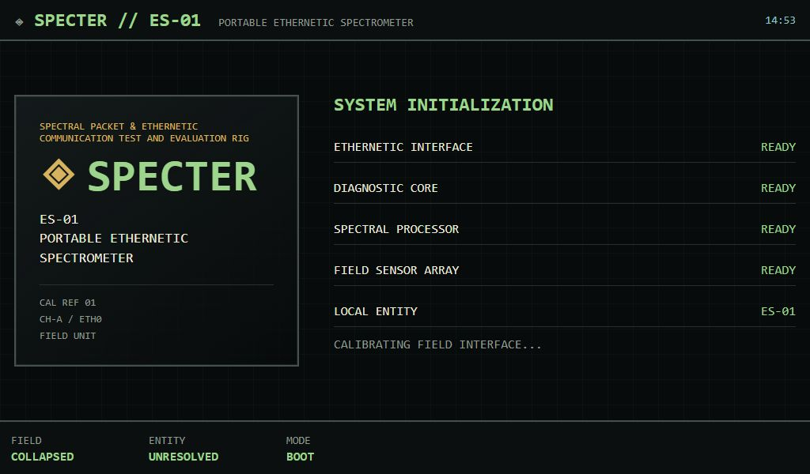](01-boot.jpg) | [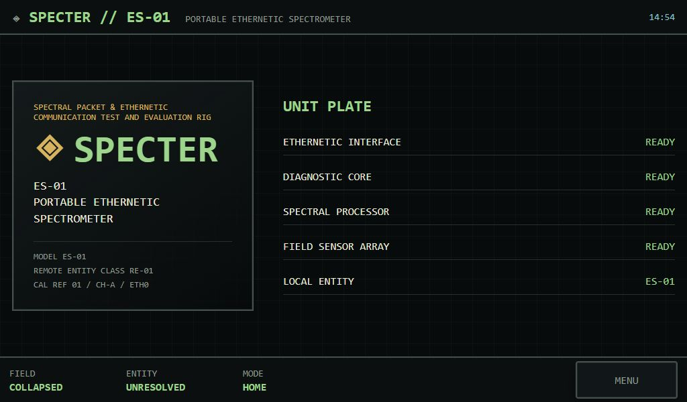](02-unit-plate.jpg) |
| **Subsystem menu** | **Ethernetic field status** |
| [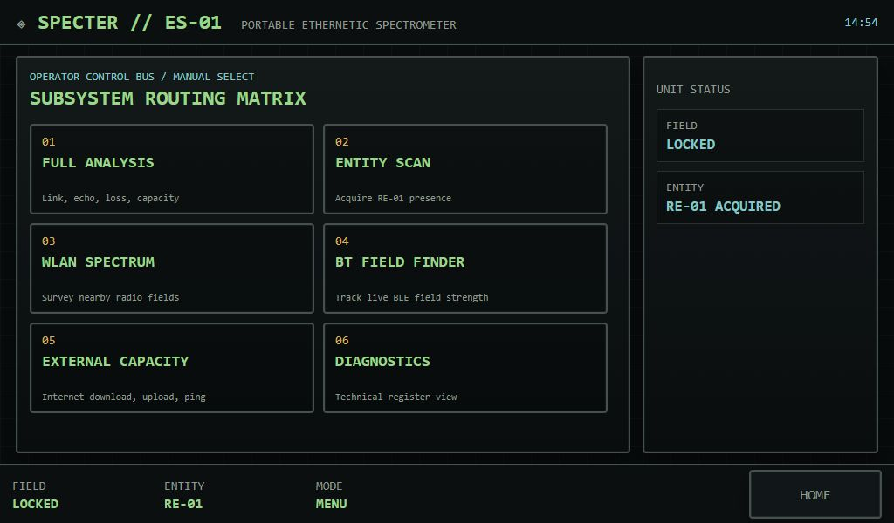](03-main-menu.jpg) | [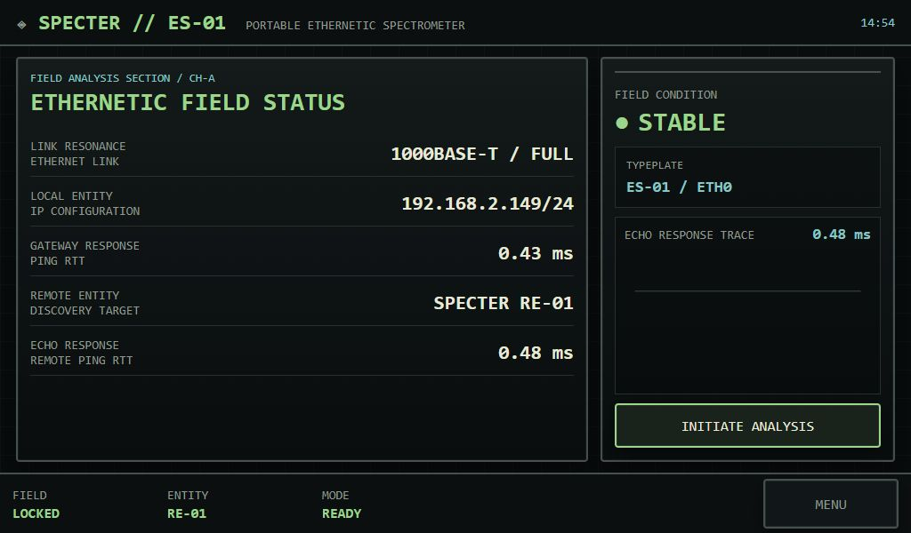](04-ethernetic-field-status.jpg) |
| **Entity scan** | **Full analysis in progress** |
| [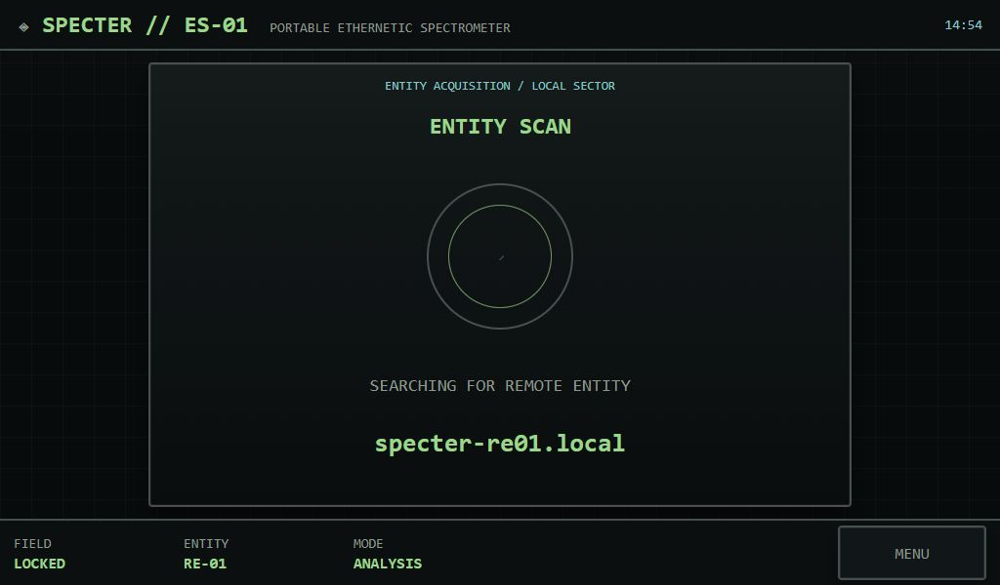](05-entity-scan.jpg) | [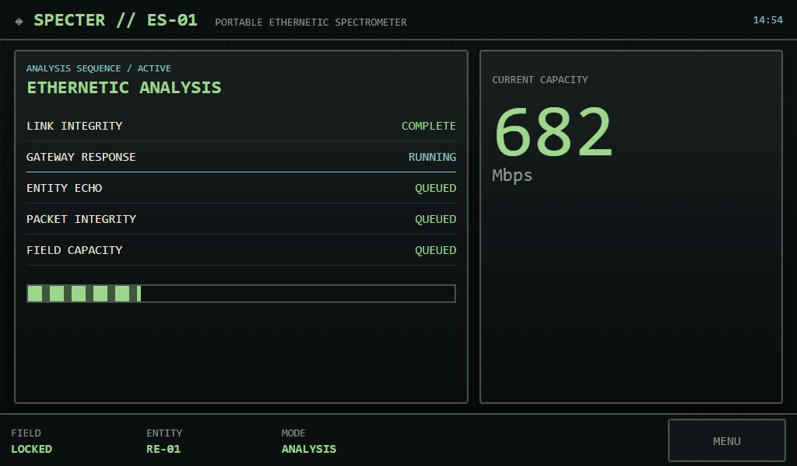](06-full-analysis.jpg) |
| **Analysis result** | **Remote entity interlock** |
| [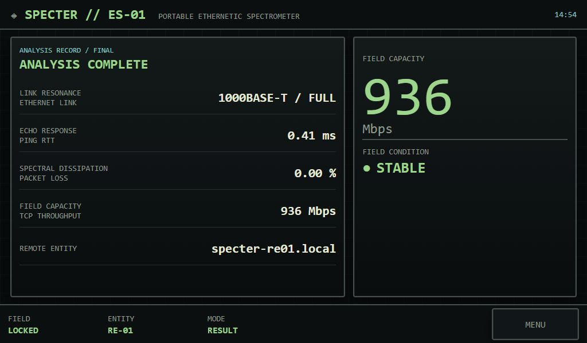](07-analysis-complete.jpg) | [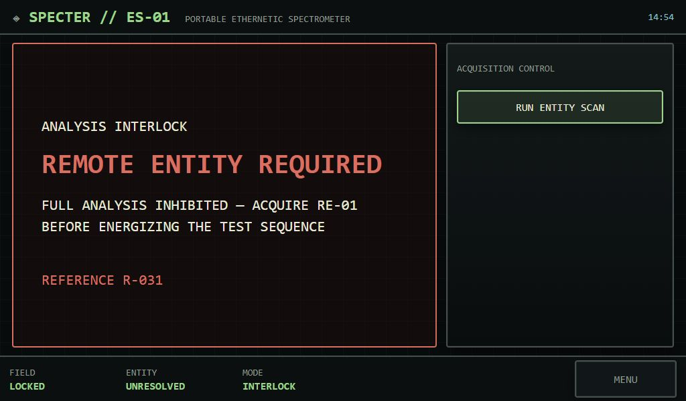](08-remote-entity-interlock.jpg) |
| **Field collapse** | **WLAN spectrum** |
| [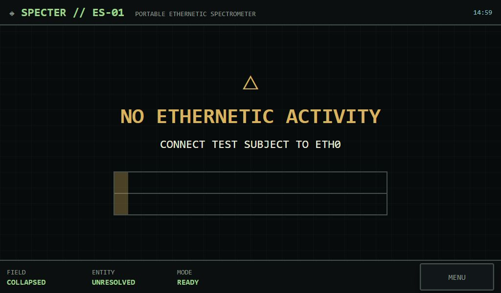](09-field-collapse.jpg) | [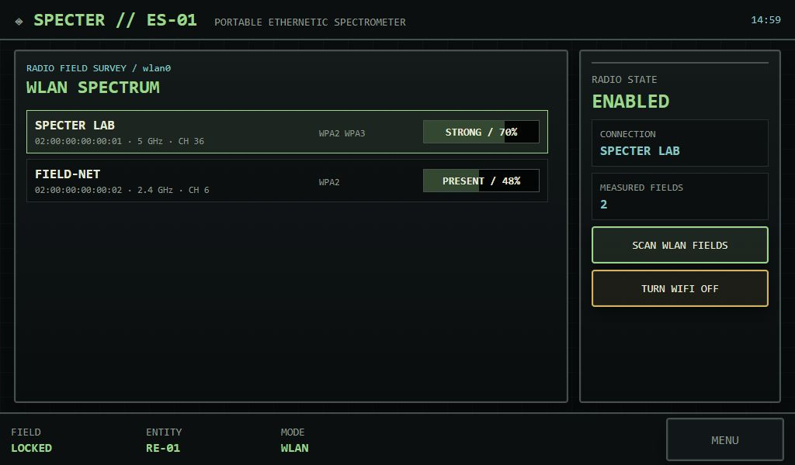](10-wlan-spectrum.jpg) |
| **BLE entity finder** | **External capacity notice** |
| [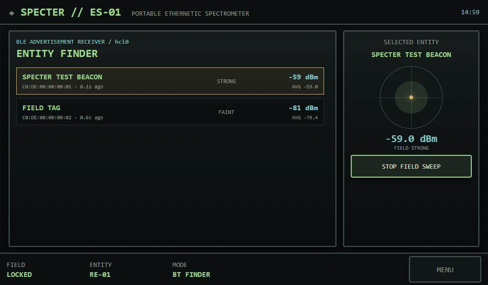](11-ble-entity-finder.jpg) | [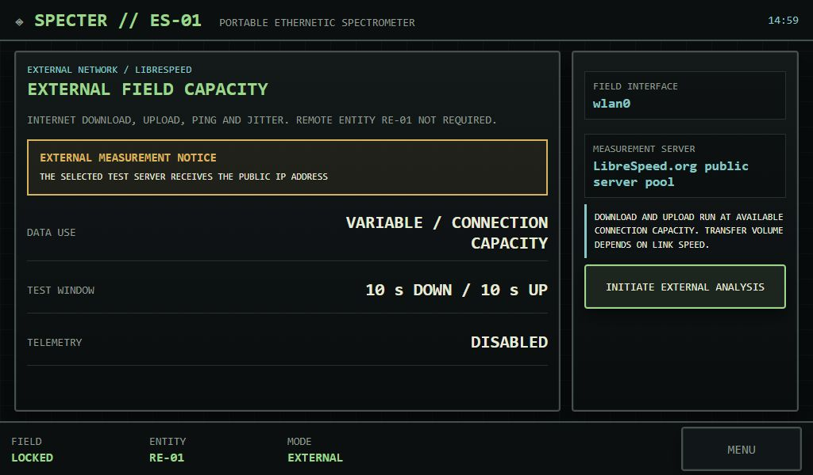](12-external-capacity.jpg) |
| **External analysis in progress** | **External analysis result** |
| [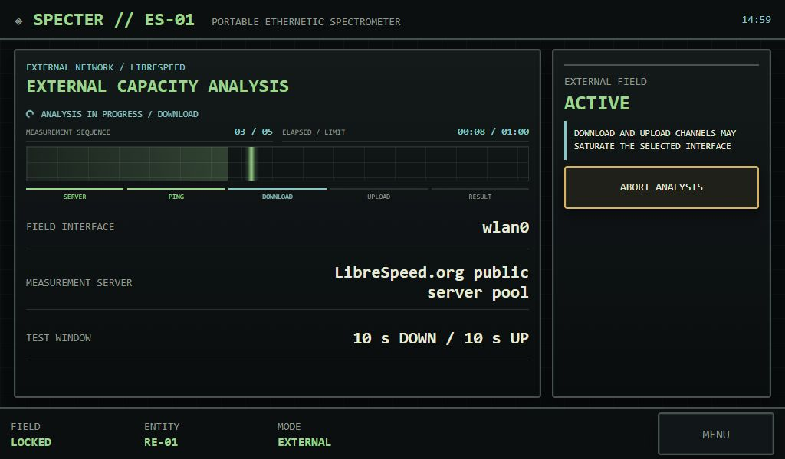](13-external-analysis.jpg) | [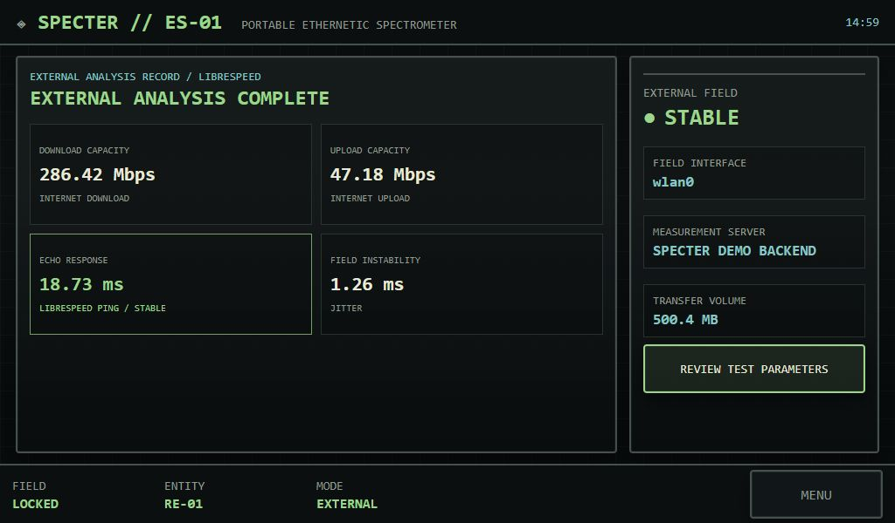](14-external-analysis-complete.jpg) |
| **Technical diagnostics** | **Acoustic signals** |
| [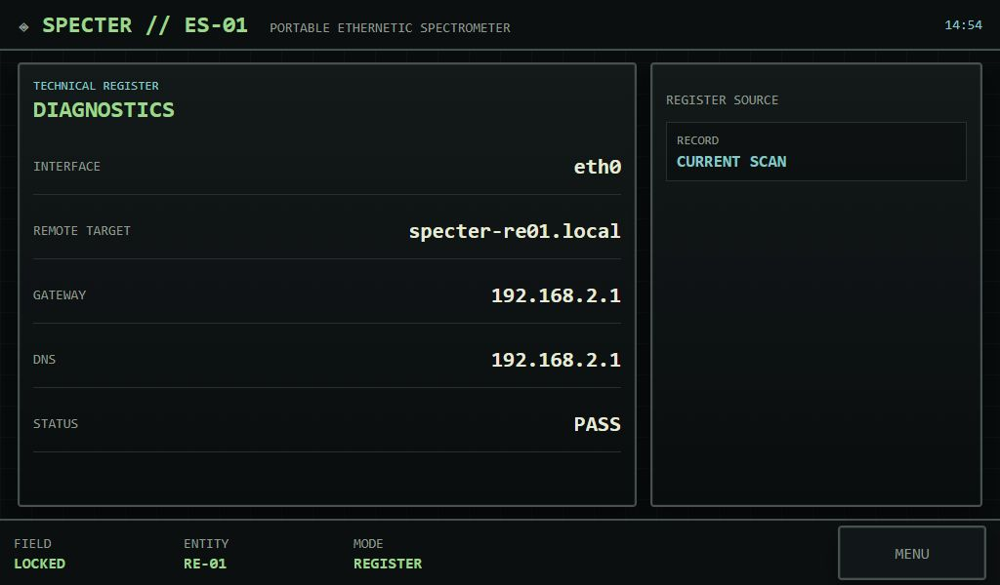](15-diagnostics.jpg) | [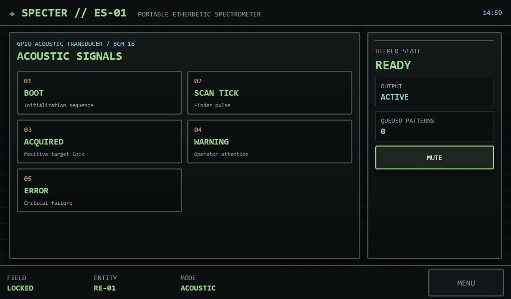](16-acoustic-signals.jpg) |
| **Standby containment array** | |
| [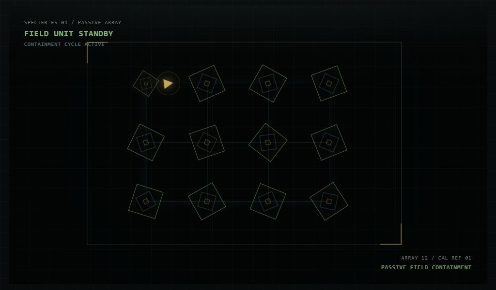](17-standby-containment.jpg) | |

These images are presentation references, not substitutes for live Raspberry Pi hardware validation. Radio readings, device identities, addresses, throughput, and timing values shown here are simulated demo data.
